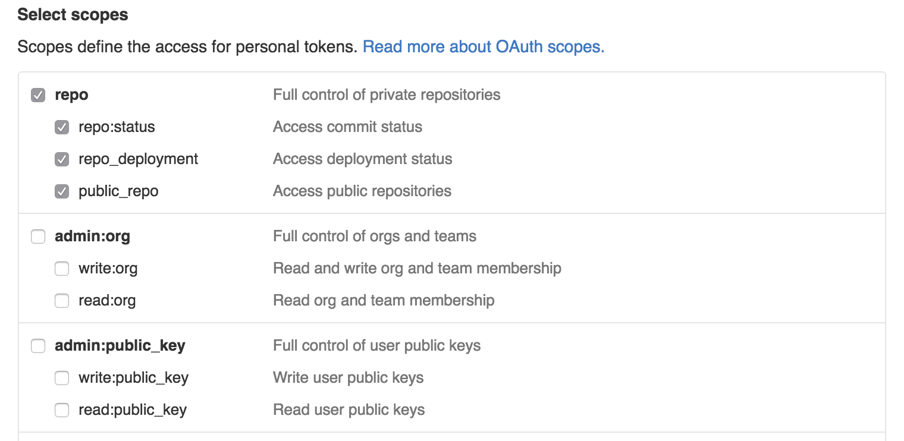

[](https://travis-ci.org/vigo/gh-issues)


# GitHub Issues

Manage your GitHub issues from command-line. If you are dealing with huge
amount of repos, this tool will become more handy.

## Idea

I need this tool for couple of reasons:

1. list all issues of my all repositories without knowing the repo url.
1. list a specific issue from a specific repo with full details.
1. see my current issues which are related to GitHub account.

## Installation

This is a command-line client. You can install via:

```bash
gem install gh_issues
```

## Usage

You need to create a [GitHub token](https://github.com/settings/tokens/new) or 
use existing token of yours. Set your environment variable as:



If you don’t want this app to access your **private repos** please check only: **public_repo**

***

```bash
export GH_ISSUES_TOKEN=your-token-here
```

If you like to get colored output by default, set:

```bash
export GH_ISSUES_COLORIZE=1
```

You can change your date format via `GH_ISSUES_DATE_FORMAT` variable. Default
value is : `%d %B %Y, %H:%M, %A`. This is `Time.strftime` format. More
information can be found [here](http://ruby-doc.org/core-2.3.0/Time.html#method-i-strftime).
Set your default such as:

```bash
export GH_ISSUES_DATE_FORMAT='%A %B %-d, %Y,  %H:%M' # example
```


All commands:

    Commands:
      gh_issues all                            # List all open issues, grouped by owner
      gh_issues help [COMMAND]                 # Describe available commands or one specific command
      gh_issues list OWNER_NAME                # List issues belongs to owner
      gh_issues show REPO_NAME [ISSUE_NUMBER]  # Show issues of REPO_NAME or ISSUE
      gh_issues version                        # Version information

    Options:
      [--color], [--no-color]  
      [--sort-by=count]        
                               # Default: name
      [--sort-order=desc]      
                               # Default: asc


### all

Lists all repos with open issues. Here is my repos:

    +------------------------------------------+-----------+
    |                          f                           |
    +------------------------------------------+-----------+
    | f/atom-bootstrap3                        |        23 |
    +------------------------------------------+-----------+
    |                                                   23 |
    +------------------------------------------+-----------+
    |                  gelistiriciyiz-biz                  |
    +------------------------------------------+-----------+
    | gelistiriciyiz-biz/gelistiriciyiz.biz    |         1 |
    +------------------------------------------+-----------+
    |                                                    1 |
    +------------------------------------------+-----------+
    |                      pyistanbul                      |
    +------------------------------------------+-----------+
    | pyistanbul/docs                          |         1 |
    | pyistanbul/itspython                     |         1 |
    | pyistanbul/website                       |        10 |
    +------------------------------------------+-----------+
    |                                                   12 |
    +------------------------------------------+-----------+
    |                      thoughtram                      |
    +------------------------------------------+-----------+
    | thoughtram/git-master-class-exercises    |         1 |
    +------------------------------------------+-----------+
    |                                                    1 |
    +------------------------------------------+-----------+
    |                         vigo                         |
    +------------------------------------------+-----------+
    | vigo/gh-issues-test                      |         4 |
    | vigo/git-tips                            |         1 |
    | vigo/ruby101-kitap                       |         1 |
    | vigo/textmate-twitterbootstrap.tmbundle  |         1 |
    +------------------------------------------+-----------+
    |                                                    7 |
    +------------------------------------------+-----------+
    |                       webBoxio                       |
    +------------------------------------------+-----------+
    | webBoxio/atom-backbone                   |         3 |
    | webBoxio/atom-color                      |        16 |
    | webBoxio/atom-hashrocket                 |         4 |
    | webBoxio/atom-html-preview               |        47 |
    | webBoxio/atom-htmlizer                   |         2 |
    | webBoxio/atom-ios                        |         1 |
    | webBoxio/atom-powersnap                  |         2 |
    | webBoxio/playbook                        |         1 |
    | webBoxio/ws-coffee                       |         1 |
    +------------------------------------------+-----------+
    |                                                   77 |
    +------------------------------------------+-----------+
    | Total amount                             |       121 |
    +------------------------------------------+-----------+
    
### list

List single repo’s issues:

```bash
gh_issues list pyistanbul

+----------------------+------+
|         pyistanbul          |
+----------------------+------+
| pyistanbul/docs      |    1 |
| pyistanbul/itspython |    1 |
| pyistanbul/website   |   10 |
+----------------------+------+
|                          12 |
+----------------------+------+
| Total amount         |   12 |
+----------------------+------+
```

### show

Show selected repo’s issues or show current GitHub repo’s. If you are in a
folder with a git repo which has github **origin** you don’t need to type
repo name!

```bash
gh_issues show   # you are in a git repo, origin is pointed to GitHub
gh_issues show pyistanbul/website
```

Here is the list:

    +-----+-----------------------------------------------------------------+-------------------------------------------------+
    |     | pyistanbul/website                                              | Url                                             |
    +-----+-----------------------------------------------------------------+-------------------------------------------------+
    | #53 | Sunum linkinin zorunlu olması                                   | https://github.com/pyistanbul/website/issues/53 |
    | #52 | [admin] Jobs listesinde pozisyon adı ve şirket adı listelenmeli | https://github.com/pyistanbul/website/issues/52 |
    | #51 | [jobs] İlanı yayından kaldırmak için seçenek eklenmesi          | https://github.com/pyistanbul/website/issues/51 |
    | #49 | Sunum başvuruları için form                                     | https://github.com/pyistanbul/website/issues/49 |
    | #48 | Issue #5: Auth, Social Auth, Profile Sayfalari                  | https://github.com/pyistanbul/website/pull/48   |
    | #47 | Sitenin database dump'ı?                                        | https://github.com/pyistanbul/website/issues/47 |
    | #46 | Sunumlar sayfasına etkinlik bilgilerinin entegre edimesi        | https://github.com/pyistanbul/website/issues/46 |
    | #43 | Sirketler tablo sayfasi                                         | https://github.com/pyistanbul/website/issues/43 |
    | #10 | Implement Facebook Open Graph meta tags                         | https://github.com/pyistanbul/website/issues/10 |
    | #5  | Profil sayfası                                                  | https://github.com/pyistanbul/website/issues/5  |
    +-----+-----------------------------------------------------------------+-------------------------------------------------+
    
If you pass **issue number** as parameter after repo name, you get the issue details:

```bash
gh_issues show pyistanbul/website 48
gh_issues show 2 # you are in a git repo, origin is pointed to GitHub, issue #2
```

Result:

    +------------+--------------------------------------------------------------------------------+
    | Repo/Issue | pyistanbul/website/48                                                          |
    +------------+--------------------------------------------------------------------------------+
    | Title      | Issue #5: Auth, Social Auth, Profile Sayfalari                                 |
    +------------+--------------------------------------------------------------------------------+
    | Opener     | bahattincinic                                                                  |
    +------------+--------------------------------------------------------------------------------+
    | Created at | 08 May 2015, 21:18, Friday (481 days ago)                                      |
    | Updated at | 19 May 2015, 14:11, Tuesday (470 days ago)                                     |
    +------------+--------------------------------------------------------------------------------+
    | Body       | [ ] Profil Guncelleme sayfasinin yapilmasi.                                    |
    |            | [ ] Kullanici ile People merge edilmesi.                                       |
    |            | People ile kullanici modelini view/template de merge edicektim ama cok hosuma  |
    |            | gitmedi. acaba direk modeli ucursak da User tablosuna initial olarak koysak mi |
    |            | veya datamigration @berkerpeksag                                               |
    |            | Yukaridaki 2 madde kaldi. Onlari yapiyim oyle merge ederiz. Bu arada yorum     |
    |            | varsa da hemde tartismis oluruz.                                               |
    |            | Yaptigim profil sayfasi su. Baya kotu oldu inline css falan yazdim. Fatihin    |
    |            | ustunden gecmesi lazim :trollface:                                             |
    |            | [screen shot 2015-05-07 at 11 19 31 pm ]-[link]                                |
    +------------+--------------------------------------------------------------------------------+
    

## Development

After checking out the repo, run `bin/setup` to install dependencies. Then, 
run `bundle exec rake test` to run the tests. You can also run `bin/console` for an 
interactive prompt that will allow you to experiment.

To install this gem onto your local machine, run `bundle exec rake install`. To 
release a new version, update the version number in `version.rb`, and then 
run `bundle exec rake release`, which will create a git tag for the version, 
push git commits and tags, and push the `.gem` file to 
[rubygems.org](https://rubygems.org).

## Contributing

Bug reports and pull requests are welcome on GitHub at 
https://github.com/vigo/gh_issues. This project is intended to be a safe, 
welcoming space for collaboration, and contributors are expected to adhere to 
the [Contributor Covenant](http://contributor-covenant.org) code of conduct.


## License

The gem is available as open source under the terms of the 
[MIT License](http://opensource.org/licenses/MIT).
